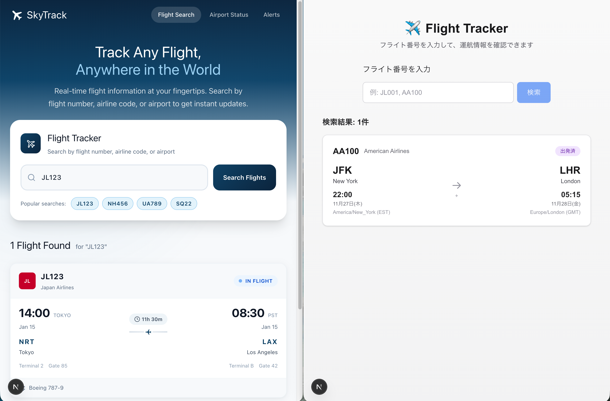

# Frontend Skills Plugin

[](LICENSE)

> **Note:** This project is for demonstrating Claude Skills with Claude Code.

A Claude Code plugin for creating distinctive, production-grade frontend UIs that avoid generic "AI slop" aesthetics. This Skill and Subagent is generated with referring Anthropic blog: [Improving frontend design through Skills](https://www.claude.com/blog/improving-frontend-design-through-skills)

## Features

- **Distinctive typography** - Effective serif × sans-serif pairings
- **Custom color palettes** - Beyond default Tailwind colors
- **Asymmetric layouts** - 35/65 ratios, overlapping elements
- **Purposeful animations** - Focused on high-impact moments

## Demo

- Left: **With Skills**
- Right: Without Skills

**Prompt:**


**Result:**



## Installation

Execute following `/plugin` slash commands in Claude Code.

```bash
# Add marketplace
/plugin marketplace add oikon48/cc-frontend-skills

# Install plugin
/plugin install frontend-skills@cc-frontend-skills
```

## Usage

Simply make frontend-related requests and the design skill will be applied automatically:

```text
Build me a flight lookup nextjs web app where the user can put in a flight number and the app gives you the start time, end time, time zones, start location, and end location of the flight. For now, use a mock API that returns a list of matching flights. Display the search results under the form input. use @frontend-design-system-implementor , ultrathink
```

This prompt is taken from the demo of Google Antigravity ([Youtube Link](https://www.youtube.com/watch?v=nTOVIGsqCuY))

## Theme Examples

1. **Nordic Minimal** - Scandinavian warmth and serenity
2. **Neon Brutalism** - Cyberpunk × brutalist fusion
3. **Organic Growth** - Natural, organic shapes
4. **Tech Noir** - Dark-mode first tech aesthetic
5. **Editorial Elegance** - Magazine-inspired editorial design

## Resources

- [SKILL.md](skills/frontend-design-system/SKILL.md) - Design guidelines
- [themes.md](skills/frontend-design-system/themes.md) - Theme implementations
- [components.md](skills/frontend-design-system/components.md) - Component patterns

## Contributing

Issues and pull requests are welcome! Feel free to contribute to this project.

## Author

[@oikon48](https://github.com/oikon48)

## License

[MIT](LICENSE)
